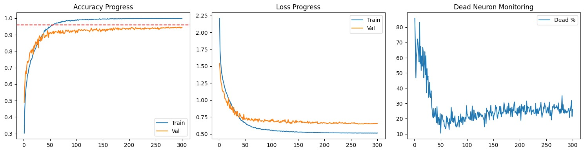

# {Music Genre Classification using CNN}

{A deep learning project focused on classifying audio signals using Convolutional Neural Networks (CNNs) implemented in PyTorch. It uses the Music Genre CLassification - [GTZAN Dataset]([text](https://www.kaggle.com/datasets/andradaolteanu/gtzan-dataset-music-genre-classification)).}

[](https://www.python.org/downloads/)

[](https://tensorflow.org)

[](https://opensource.org/licenses/MIT)

## Goal

My goal with this project is to familiarize myself with Pytorch, CNN architecture and Data Processing beyond the theory. Music Classification is a well studied area, which meant I could learn from others in the field.

Much of my fundamentals come from college curriculum where we were taught from the very beginning i.e. Statistical Analysis, all the way to Ridge Regression, Dimensionality Rduction, Gradient Descent etc. 

Pytorch was my choice as I had made myself comfortable with it as I followed along with Andrej Karpathy in his Github Series [NN-Zero-to-Hero]([text](https://github.com/karpathy/nn-zero-to-hero)). His lectures provided much clarity on the actual code implemetation of Neural Networks.

I will continue to update this project as there are several issues to be resolved

## 🎯 Project Overview

This project implements a CNN model to classify 10 music genre.

### Key Features

- 🧠 **Model Architecture**: CNN
- 📊 **Dataset**: GTZAN Music Genre CLassifier  
- 🎯 **Performance**: >90% Accuracy over Validation Data

## 📋 Requirements

- Python 3.10+
- CUDA-compatible GPU (recommended)
- 8GB+ RAM

## 🚀 Quick Start

### Installation

```bash
git clone https://github.com/{USERNAME}/{PROJECT_NAME}.git
cd {PROJECT_NAME}

# Create virtual environment
python -m venv venv
source venv/bin/activate  # On Windows: venv\Scripts\activate

# Install dependencies
pip install -r requirements.txt
```

## 📊 Dataset

### Dataset Information

- **Source**: [GTZAN Dataset]([text](https://www.kaggle.com/datasets/andradaolteanu/gtzan-dataset-music-genre-classification))
- **Size**:  9990 total samples
- **Classes**: 10 (Blues, Classical, Country, Disco, Hiphop, Jazz, Metal, Pop, Reggae, Rock)
- **Split**: Train (80%) / Validation (20%)

### Data Structure

```
processed_data/
├── data_tensors.pt
├── matadata.json
├── data_arrays.npz
```

### Data Processing Pipeline

```
Raw audio loading
   ↓
MFCC feature extraction
   ↓
Delta and Delta-Delta computation
   ↓
Normalization using BatchNorm
   ↓
Train/Validation split

```
## 🏗️ Model Architecture

### Network Structure

```
Input (3, 13, 128)  # [Channels (MFCC/Delta/Delta-Delta), Coefficients, Time]
    ↓
Conv Block 1 (64 filters, ELU, MaxPool, Dropout 0.1)
    ↓
Conv Block 2 (128 filters, ELU, MaxPool, Dropout 0.2)
    ↓
Conv Block 3 (256 filters, ELU, MaxPool, Dropout 0.3)
    ↓
Conv Block 4 (512 filters, ELU, AdaptiveAvgPool, Dropout 0.4)
    ↓
Flatten -> Fully Connected (256) -> ELU -> Dropout (0.5)
    ↓
Output (10 Classes, Softmax/Logits)
```

## 🎓 Training

### Hyperparameters

```yaml

# config.yaml
model:
  input_shape: (Batch_Size, 3, 13, 128)
  num_classes: 10
  activation function : ELU

training:
  batch_size: 64
  epochs: 300
  learning_rate: 0.001 (CosineAnnealingLR, T-max = epochs)
  optimizer: AdamW
  weight decay : 1e-4
  patience : 20
  loss: CrossEntropy
  label smoothing : 0.1

data:
  BatchNorm : True
  Dropout : True
  validation_split: 0.2
```

## 📈 Results

### Training Performance 

| Environment       | Time per Epoch | Total Training Time |
| ----------------- | -------------- | ------------------- |
| Local (GTX 1650)  | ~18 seconds    | ~90 minutes         |
| Google Colab (T4) | ~10 seconds    | ~50 minutes         |

- Those who possess better GPU cards can expect to see lower total training times than those stated above.

### Dead Neurons 

| Function       | Accuracy | Dead Neurons |
| -------------- | -------- | ------------ |
| ReLU           | ~86%     | ~75%         |
| Leaky ReLU     | ~92%     | ~45%         |
| ELU            | ~96%     | ~23%         |

- The use of ReLU led to a large parcentage of dead neurons, to solve this issue the activation function was updated to Leaky ReLU with a small negative slope and finally to ELU. This reduced the percentage of dead neurons but has not completely resolved the issue.

### Graph



- Graph depicting the accuracy, loss and percentage of dead neurons in the model over the entire training process. This is the highest accuracy the model has achieved yet.

## ⚠️ Known Issues & Warnings

- TensorFlow version may have compatibility issues

- Missing DLL errors possible on Windows systems

- Consider using PyTorch version for reliability

## 🎯 Future Improvements

- Reduce Dead Neurons: Target <5% dead neurons

- Architecture Optimization: Make model leaner while maintaining accuracy and robustness

- Data Augmentation: Implement audio augmentation techniques

- Model Explainability: Add visualization tools for model decisions

# 🤝 Contributing

While this is primarily a learning project, suggestions and improvements are welcome! Please ensure any changes maintain the educational focus of the project.